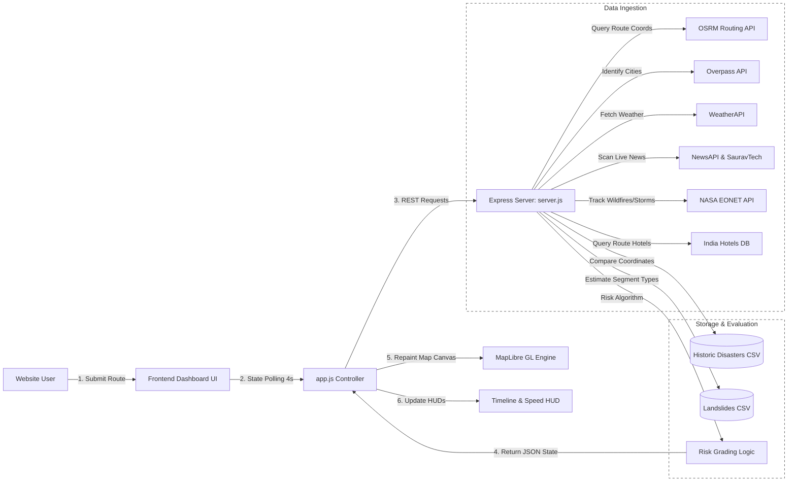
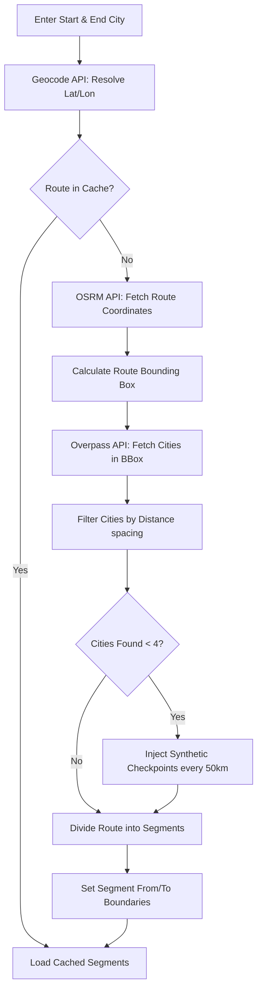
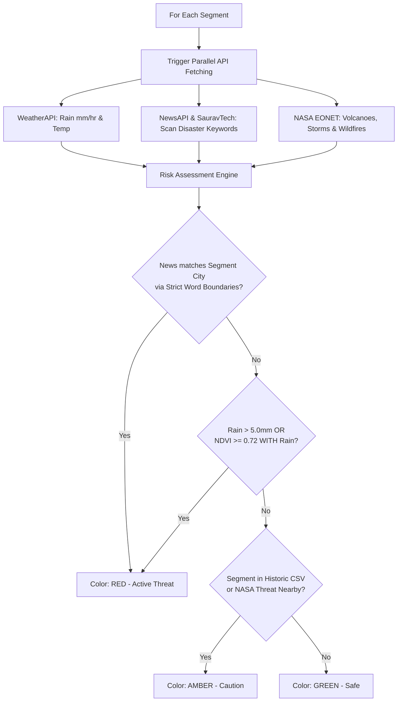
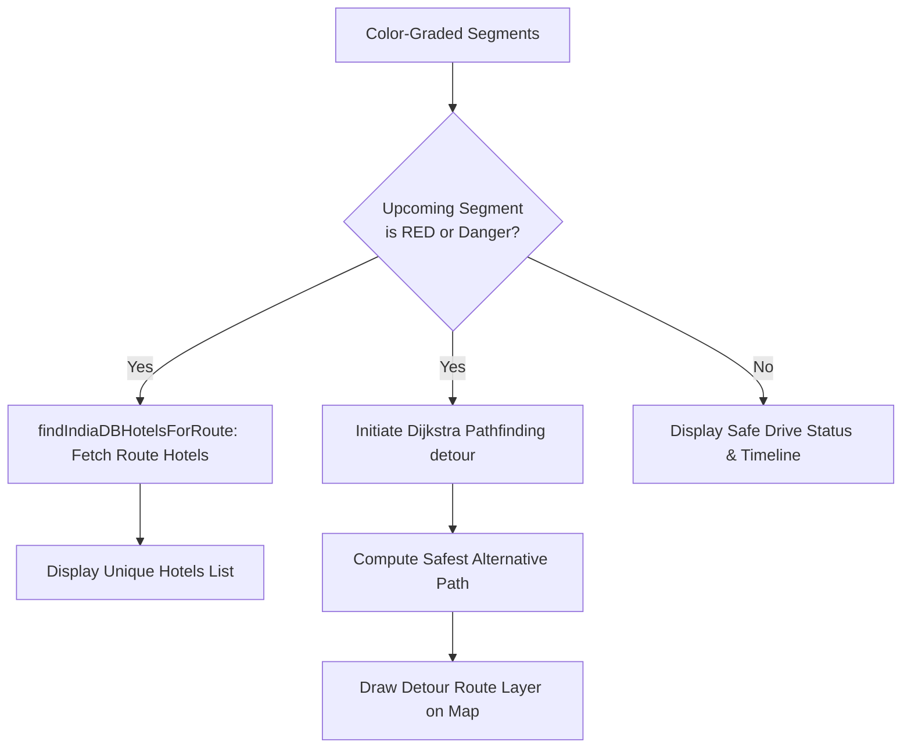
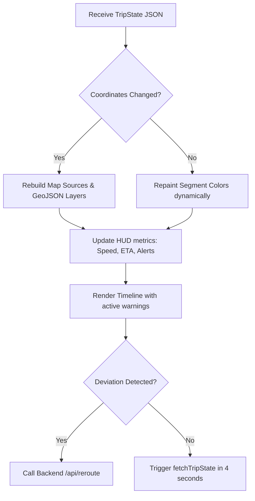

# DriveSphere
[](./LICENSE)
> **Intelligent Driving Dashboard with Hazard-Aware, Real-Time Dynamic Routing & Driver Assistance**

---

## Overview

**DriveSphere** is a next-generation navigation and safety platform designed to provide drivers with an "Electronic Horizon"—the ability to see hazards, weather conditions, and disasters well beyond their physical line of sight.

Traditional GPS systems only care about the fastest route. DriveSphere constantly evaluates your path against **live news reports, NASA satellite feeds, weather precipitation, road curvature, and vegetation density (NDVI)** to determine the safety of every segment of your journey.

If a disaster, landslide risk, or extreme flood is detected ahead, the system dynamically reroutes you using an integrated **Dijkstra's Pathfinding Algorithm** and suggests **emergency hotel shelters** so you can stop driving before entering danger zones.

---

## Key Features

1. **3D Interactive Map Engine (MapLibre GL JS):** Responsive 3D map canvas with automatic terrain adjustments, real-time vehicle simulation, and smooth camera transitions.
2. **Multi-Source Hazard Ingestion:**
   - **Live News Analysis (NewsAPI & DuckDuckGo):** Scans articles published in the last 5 days for strict hazard keywords (e.g. *landslide, flood, accident*) matching specific towns along the route.
   - **NASA EONET Integration:** Live tracking of global events like wildfires and severe storms, plotted as interactive map indicators.
   - **Historic Danger CSV:** References a local database (`ND_places_regenerated.csv`) of historic natural disaster zones.
3. **Atmospheric & Vegetation Telemetry:**
   - Evaluates **precipitation and visibility** using WeatherAPI.
   - Calculates **landslide risk** by checking if high NDVI (vegetation density) is paired with heavy rain on curvy roads.
4. **Dynamic Route Segmenting:** Automatically slices long routes (e.g. 600km) into ~50km segments by injecting synthetic checkpoints if Overpass API fails. This ensures a hazard in one town doesn't incorrectly turn your entire route red.
5. **Emergency Shelter Recommendation:** Automatically fetches and recommends at least 5 local hotels using **SerpApi (Google Hotels)** or Overpass API cache when the path ahead is blocked.

---

## High-Level System Architecture

The frontend controls the user experience and maps out routes, while the Node.js backend handles geocoding, API aggregation, and segment risk grading.



---

## Detailed Workflows

### Phase 1: Route Planning & Dynamic Segmentation
This phase geocodes destinations, fetches coordinate geometry, queries route cities, and dynamically segments paths.



---

### Phase 2: Real-Time Hazard Scanning & Color Grading
Every 4 seconds, the backend runs segment coordinates through this logic to determine safety colors.



---

### Phase 3: Emergency Shelter & Dijkstra Detour Rerouting
When a segment is flagged as Red, the driver is warned, local hotels are fetched, and a Dijkstra visualizer computes the safest detour.



---

### Phase 4: UI Lifecycle & Map State Syncing
The frontend handles data synchronization, updating progress metrics, supporting "Stop Searching" (via AbortController), and repainting segment colors dynamically.



---

## API Reference & Credentials

To run the application, configure your `.env` file or environment variables with the following:

| Variable | API Provider | Purpose |
| :--- | :--- | :--- |
| `WEATHER_API_KEY` | [WeatherAPI](https://www.weatherapi.com/) | Live precipitation and weather state checks |
| `NEWS_API_KEY` | [NewsAPI](https://newsapi.org/) | Scans local news for keywords matching segment cities |

---

## Installation & Setup

### Prerequisites
- [Node.js](https://nodejs.org/) (v18.x or higher)
- NPM or Yarn

### Step-by-Step Run Guide

1. **Clone the repository**
   ```bash
   git clone https://github.com/Varshith10121901/E---horizon-driving-system
   cd E---horizon-driving-system
   ```

2. **Install Dependencies**
   ```bash
   npm install
   ```

3. **Set Up Keys**
   Create a `.env` file in the root folder (Note: `.env` is ignored by git to keep your keys safe):
   ```env
   WEATHER_API_KEY=your_weather_api_key
   NEWS_API_KEY=your_news_api_key
   ```

4. **Start the Application**
   ```bash
   npm start
   ```

5. **Access the Dashboard**
   Open your browser and navigate to `http://localhost:3000`.

---

## License

This project is licensed under the [MIT License](./LICENSE).
